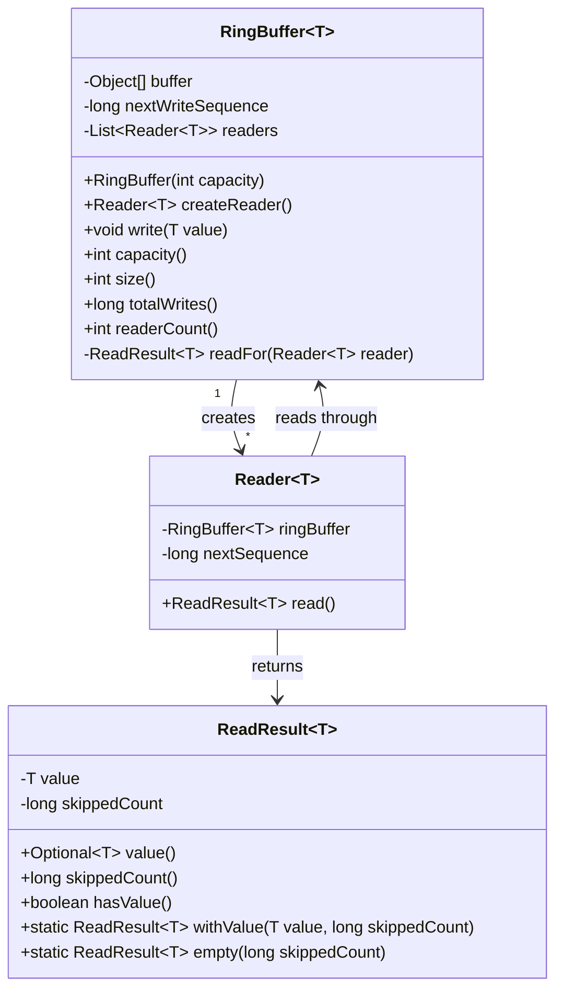
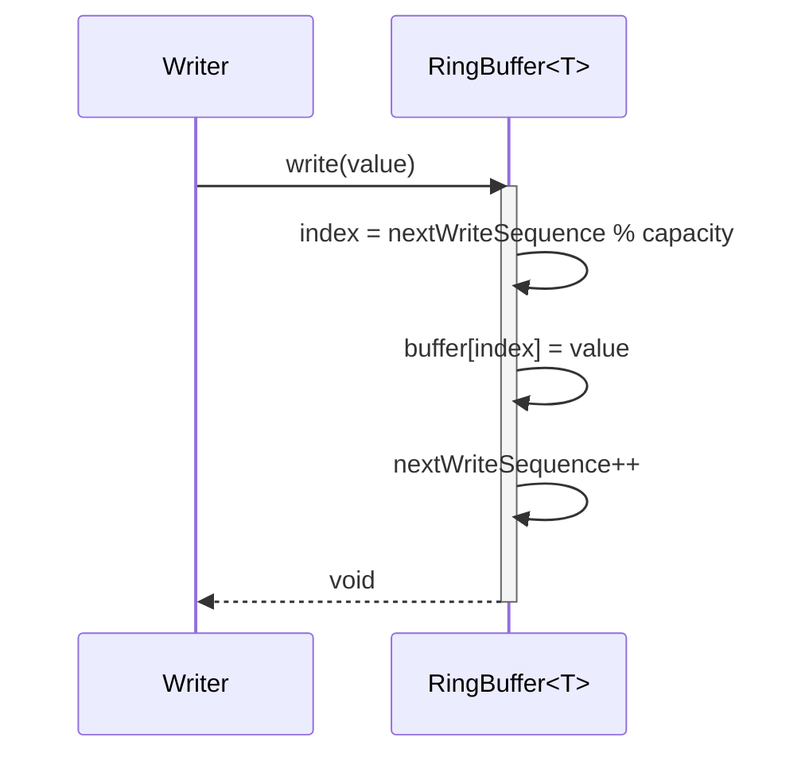
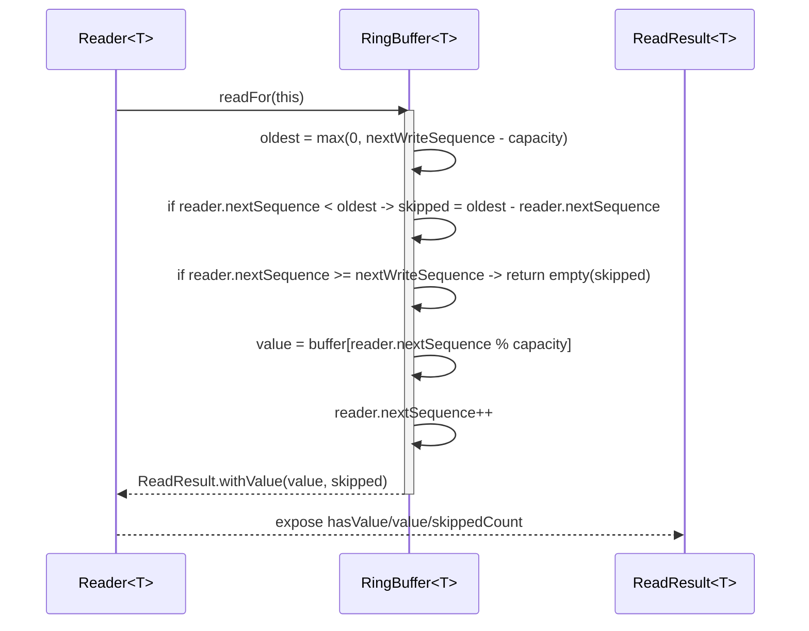

# Multi-Reader Ring Buffer (Single Writer)

## Project Overview
This project implements a fixed-capacity ring buffer in Java that supports:
- one writer
- multiple independent readers
- overwrite-on-full behavior

When the writer overwrites old entries, slow readers automatically skip missed data and continue from the oldest currently available item.

## Design (OO Responsibilities)

### `RingBuffer<T>`
- Owns fixed-size storage and write index progression.
- Accepts writes from a single writer (`write(T value)`).
- Creates and tracks reader instances (`createReader()`).
- Performs overwrite-aware read logic for each reader cursor.

### `Reader<T>`
- Represents one reader with its own private read position (`nextSequence`).
- Calls `read()` independently of other readers.
- Never removes data globally; it only advances its own cursor.

### `ReadResult<T>`
- Value object returned by `Reader.read()`.
- Contains:
  - optional value (`value()` / `hasValue()`)
  - skipped item count (`skippedCount()`) if overwrite caused missed data.

## UML Class Diagram



## UML Sequence Diagram for `write()`



## UML Sequence Diagram for `read()`



## How to Run / Test

From the repository root:

```bash
./gradlew test
```

Optional run of sample app:

```bash
./gradlew run
```

### Expected Sample Output

Output values should follow this pattern:

```text
Ring Buffer Demo
Capacity: 3
Fast reader reads: 1, 2
Slow reader next value: 3
Slow reader skipped: 2
Fast reader continues: 3, 4, 5
```

Explanation:
- buffer capacity is 3
- after writing `1,2,3,4,5`, values `1,2` are overwritten
- slow reader started at the beginning, so it misses 2 items and resumes from `3`

## Notes
- This implementation is synchronized for simple thread-safety.
- It enforces the assignment model of single writer + multiple independent readers.
